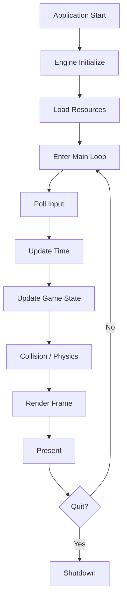

> [!abstract] 문서 개요
> 도트 게임 엔진이 실행되고 종료되기까지의 기본 흐름을 정리한다.
> 엔진 루프는 입력, 시간, 게임 상태, 물리/충돌, 렌더링을 일정한 순서로 처리한다.

## Life Cycle Overview

도트 게임 엔진의 라이프사이클은 크게 `Initialize -> Run Loop -> Shutdown`으로 나뉜다.



## Initialize

엔진이 실행되면 먼저 실행 환경을 준비한다.

- Window 생성
- Renderer 초기화
- 입력 시스템 초기화
- 타이머 초기화
- 리소스 경로 설정
- 기본 Scene 또는 Game State 생성

## Resource Loading

게임 루프에 들어가기 전에 필요한 리소스를 준비한다.

- Sprite / Texture 로드
- Tilemap 로드
- Font 로드
- Sound 로드
- Animation 데이터 로드
- Collision 데이터 로드

도트 게임에서는 Sprite, Tile, Palette, Animation Frame 같은 작은 단위 리소스를 자주 사용한다.

## Main Loop

엔진의 핵심 루프다.

```cpp
while (engine.isRunning())
{
    engine.pollInput();
    engine.updateTime();
    engine.update();
    engine.render();
}
```

## Input

플레이어 입력과 시스템 이벤트를 수집한다.

- 키보드 입력
- 마우스 입력
- 게임패드 입력
- 창 닫기 이벤트
- 포커스 변경 이벤트

입력은 현재 프레임에서만 유효한 값과, 계속 유지되는 값을 분리해서 관리한다.

- Pressed: 이번 프레임에 눌림
- Down: 누르고 있는 중
- Released: 이번 프레임에 뗌

## Time

프레임 간 시간 차이를 계산한다.

- Delta Time 계산
- FPS 계산
- Fixed Update 누적 시간 계산

도트 게임은 움직임과 애니메이션이 픽셀 단위로 보이는 경우가 많기 때문에, 시간 처리 방식이 화면 느낌에 큰 영향을 준다.

## Update

게임 상태를 갱신한다.

- Scene 갱신
- Entity 갱신
- Component 갱신
- Animation 갱신
- AI 갱신
- Script 또는 Gameplay Logic 실행

일반적으로 입력 결과는 `Update` 단계에서 게임 오브젝트의 상태 변화로 반영된다.

## Collision / Physics

위치와 충돌 상태를 계산한다.

- Tile Collision
- AABB Collision
- Trigger 판정
- 이동 보정
- 바닥 / 벽 / 천장 판정

도트 게임에서는 정교한 물리 엔진보다 예측 가능한 충돌 규칙이 더 중요할 때가 많다.

## Render

현재 게임 상태를 화면에 그린다.

- 화면 클리어
- Camera 적용
- Tilemap 렌더링
- Sprite 렌더링
- UI 렌더링
- Debug Overlay 렌더링
- Back Buffer Present

렌더링 단계에서는 게임 상태를 변경하지 않는 것을 기본 원칙으로 한다.

## Shutdown

게임 종료 시 리소스를 정리한다.

- Scene 제거
- Texture / Sprite 해제
- Sound 해제
- Renderer 종료
- Window 제거
- 로그 저장

## Recommended Order

기본 프레임 처리 순서는 다음과 같이 둔다.

1. OS Event 처리
2. Input 상태 갱신
3. Delta Time 계산
4. Fixed Update 처리
5. Gameplay Update 처리
6. Collision 처리
7. Animation 처리
8. Render Command 수집
9. 화면 출력

## Notes

- 렌더링과 게임 로직은 가능한 한 분리한다.
- 충돌 처리는 이동 전, 이동 후, 보정 단계를 명확히 나눈다.
- 도트 게임에서는 카메라 좌표와 스프라이트 좌표를 정수 픽셀에 맞추는 정책이 필요하다.
- 디버그 모드에서는 FPS, Collision Box, Tile Index, Entity Count를 표시할 수 있게 한다.
